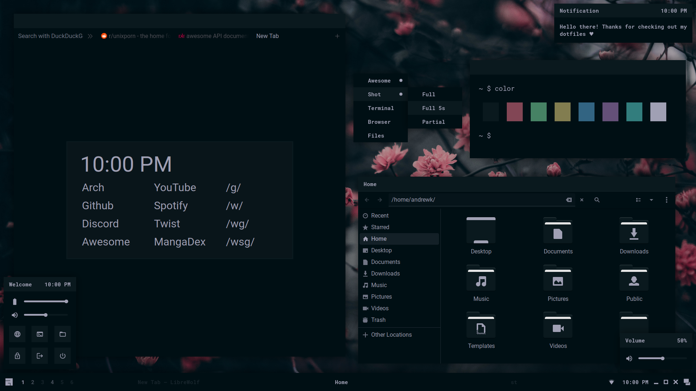

<h1 align=center>Sakura Dotfiles</h1>

This is my desktop made with awesomewm! Here's some details:

- **Operating System** - endeavouros
- **Window Manager** - awesomewm
- **File Manager** - nautilus
- **Browser** - librewolf
- **Terminal** - st
- **Shell** - bash
- **Editor** - vim

## Installation

Coming soon...

## Contact

You can find me on discord at `Stardust-kyun#5994`.
