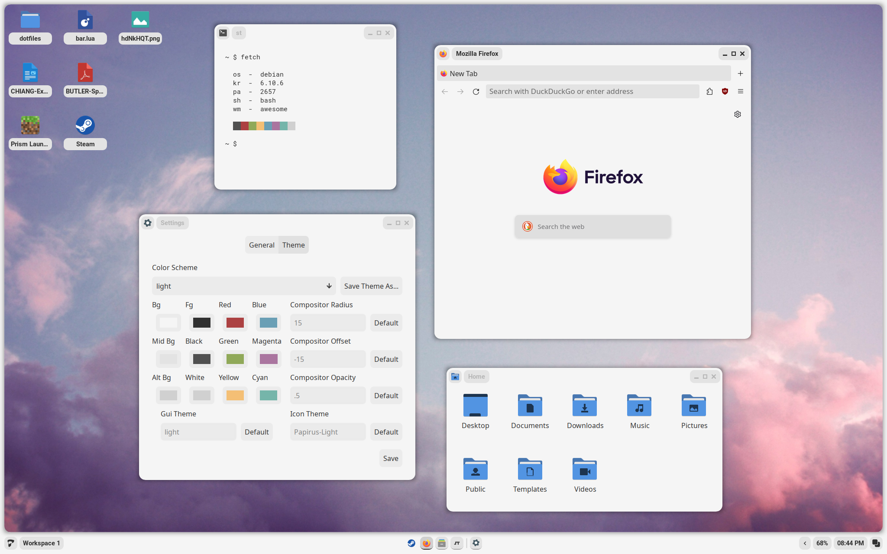
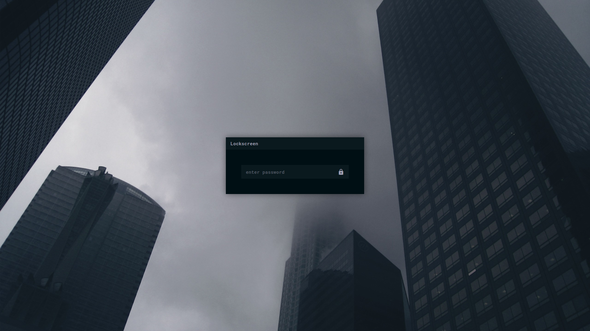

<h1 align=center>Calla</h1>

<a href="#install">Install</a> - <a href="#usage">Usage</a> - <a href="#gallery">Gallery</a> - <a href="#credit">Credit</a> - <a href="#contact">Contact</a>

[showcase](https://github.com/Stardust-kyun/dotfiles/assets/56178655/d52b1338-b3f6-444e-b97c-59bdc2544414)

## Install

### Read Before Installing

In my previous work, I have provided scripts to make it much easier for the average user to install. However, I have found that these scripts are a massive pain to maintain for a variety of distributions, so this time I have provided universal instructions instead. These instructions have been written based on my Debian installation, so you may find that you have additional steps. If you have any questions, see <a href="#contact">contact</a>.

<b>Installation</b>

---

### Minimal Installation Packages

These packages use their names from the Debian repos. If you can't find them for your distribution, try using the source url from Debian repos.

- xorg - display server
    + xclip - clipboard
    + xsettingsd - reload gtk/icons
- pipewire - audio
    + pipewire-pulse - volume signal
    * pulseaudio-utils - volume signal
- brightnessctl - brightness
    + inotify-tools - brightness and desktop signal
- [awesome-git](https://github.com/awesomeWM/awesome) - window manager (built on commit ad0290b)
- picom - compositor
- maim - screenshot
- ttf-roboto - gtk font
- ttf-roboto-mono - mono font
- noto-fonts - general font support
- noto-fonts-cjk - cjk font support
- noto-fonts-emoji - emoji font support
- noto-fonts-extra - extra font support
- papirus-icon-theme - icon theme

### Recommended Packages

- [st](https://github.com/siduck/st) - terminal (supports live reloading, more support WIP)
- gvim - vim with clipboard
- firefox-esr - browser (extended support release)
- nemo - file manager
- network-manager-applet - network applet
- polkit-gnome - polkit
- cbatticon - battery applet
- blueman - bluetooth applet
- xdg-user-dirs - generate home directories

### Setup

- copy contents of `home` to `~/`
- enable NetworkManager service (if network-manager-applet installed)
- update font cache `fc-cache -fv`
- update xrdb `xrdb ~/.Xresources`
- generate home dirs `xdg-user-dirs-update`
- make screenshots dir in `~/Pictures/Screenshots`

---

## Usage

<b>Settings App</b>

---

Calla contains a settings app to configure itself without editing any files. It can be opened through the Calla icon in the launcher, or by pressing `Mod+Shift+C`.

### General

- Terminal - The terminal to run on `Mod+Enter`
- Shutdown/Reboot - The commands to use to shutdown and reboot the system
- Fallback Password - The password Calla will use if it cannot use your user's password
- Font(s) - Fonts used throughout the desktop environment
- Battery - The name of your system's battery (found in `/sys/class/power_supply/`
- Wallpaper - If you would like to overwrite the theme's default wallpaper
- Screenshot Directory - The directory that screenshots are saved to

### Theme

- Color Scheme - The theme Calla will use
- Colors - The colors the theme will use, in base8
- Compositor Settings - Settings for the shadow picom sets
- Gui/Icon Theme - The names of the gui and icon themes the theme should use

---

## Gallery

<b>Screenshots</b>

---

### Apps

### Launcher

### Tag Preview

### Volume/Brightness Popup

### Lock Screen

---

## Credit

### Thanks

- [Sammy](https://github.com/TorchedSammy) for help understanding and adding live reloading.
- [Crylia](https://github.com/Crylia) for massive amounts of help learning awesomewm.
- [Jimmy](https://github.com/Jimmysit0) and [Petrolblue](https://github.com/petrolblue) for help with color schemes and lots of support.
- And the support of many more!

### Historical Contributions

- [AloneERO](https://gitlab.com/AloneER0) for help adding support for Void, Fedora, OpenSUSE, and Alpine!
- [Frankfut](https://github.com/frankfutlg) for help adding support for Void and lots of help with debugging.
- [Qwickdom](https://github.com/Qwickdom) for help adding support for Arch.
- [Reverse](https://github.com/Reversedc) for help adding support for Debian.
- [Alyssa](https://github.com/alyssa-sudo) for help adding support for Gentoo.

### References

- [Sammy's Dotfiles](https://github.com/TorchedSammy/dotfiles)
- [Saimoom's Dotfiles](https://github.com/saimoomedits/dotfiles)
- [Smeueg's Dotfiles](https://github.com/Smeueg/Dotfiles)
- [Bling](https://github.com/BlingCorp/bling)

### Projects

- [Phocus](https://github.com/phocus/gtk)

## Contact

You can find my contact information on my [website](https://star.is-a.dev/). I also have a [discord server](https://discord.gg/38hQb6V8AW) with help available and updates for when new features are added.
