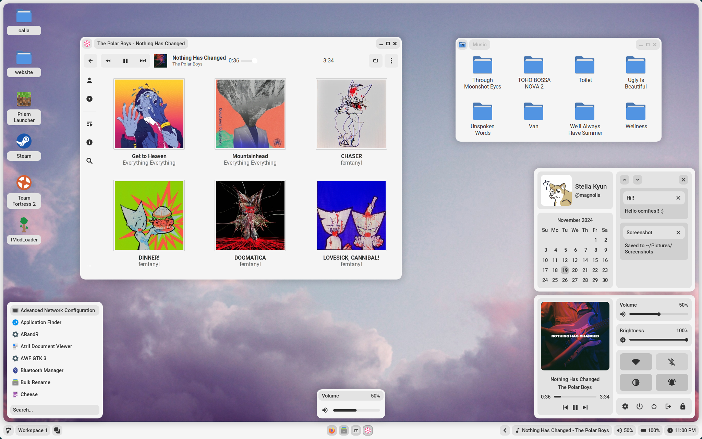
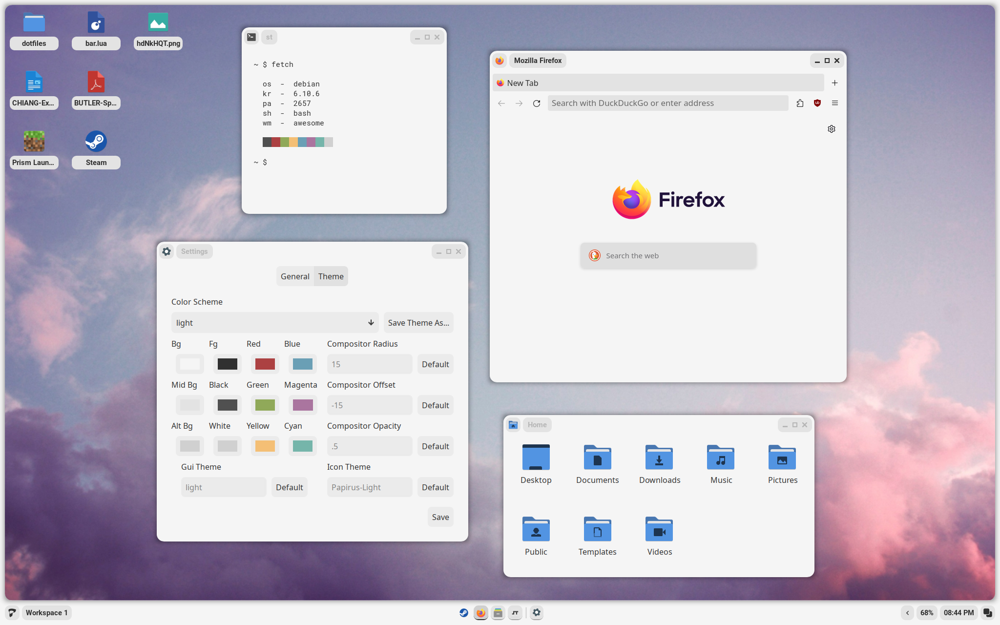
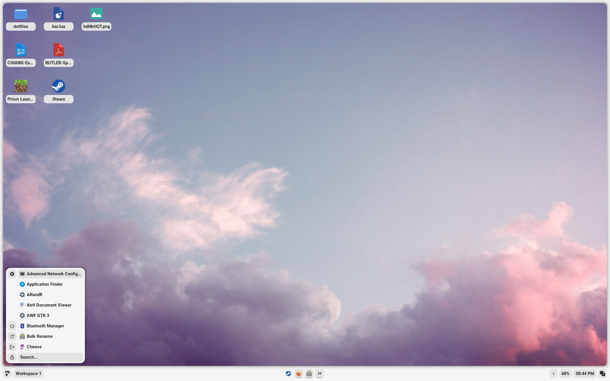
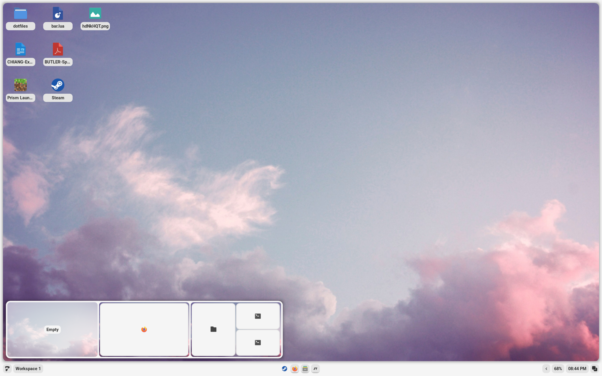
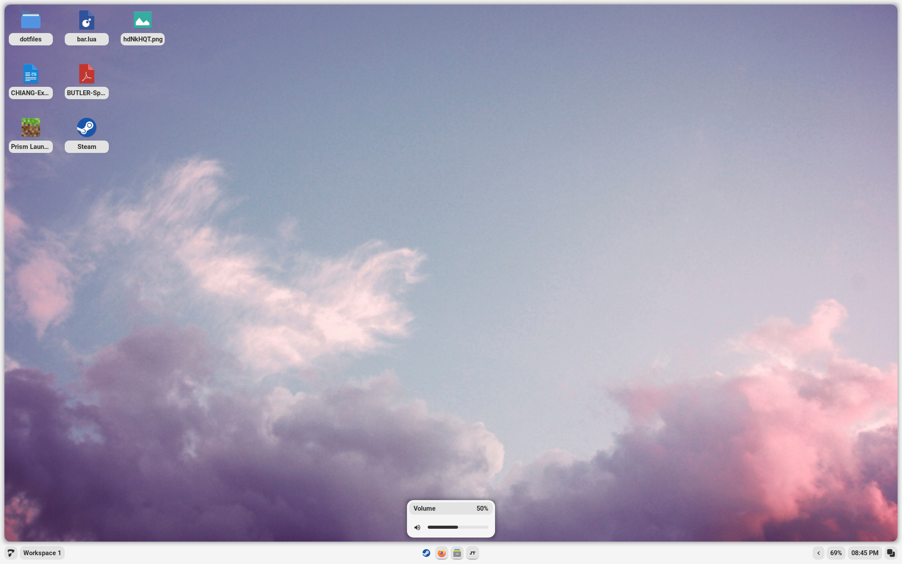
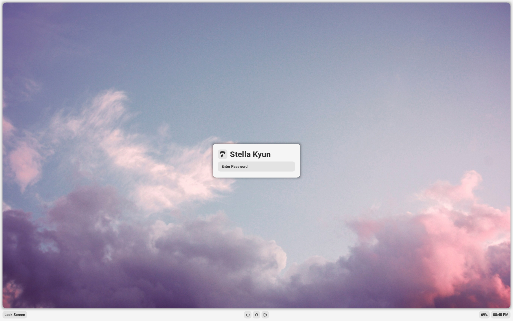

<h1 align=center>Calla</h1>

<a href="#install">Install</a> - <a href="#usage">Usage</a> - <a href="#gallery">Gallery</a> - <a href="#credit">Credit</a> - <a href="#contact">Contact</a>

---

<!-- [showcase](https://github.com/Stardust-kyun/dotfiles/assets/56178655/d52b1338-b3f6-444e-b97c-59bdc2544414) -->

---

## Install

### Read Before Installing

In my previous work, I have provided scripts to make it much easier for the average user to install. However, I have found that these scripts are a massive pain to maintain for a variety of distributions, so this time I have provided universal instructions instead. These instructions have been written based on my Debian installation, so you may find that you have additional steps. If you have any questions, see <a href="#contact">contact</a>.

<b>Installation</b>

---

# Under Construction

Installation instructions are currently being revised as Calla is packaged for major distros. As of version 0.3.0-1, only Debian is supported. If you are attempting to install Calla on Debian, find the newest release in the releases tab. If you are attempting to install on other distros, make sure you have the following installed:

- AwesomeWM git
- Your distribution's package equivalents for line 4 of `DEBIAN/control` (the line that starts with `Depends:`)

Calla currently comes pre-packaged with a version of AwesomeWM git for Debian. To avoid issues, remove the `src/usr/local` directory of this repo as well as the `calla-awesome` and `calla-awesome-client` files in `src/usr/bin`. You will need to edit `src/usr/bin/calla` to run `awesome` instead of `calla-awesome`. Once this is complete, all you should need to do is copy the `src/usr` directory to your root directory, merging it with your current `usr` directory.

---

## Usage

<b>Settings App</b>

---

Calla contains a settings app to configure itself without editing any files. It can be opened through the settings icon in the control center, or by pressing `Mod+Shift+C`.

### General

- Terminal - The terminal to run on `Mod+Enter`
- Shutdown/Reboot - The commands to use to shutdown and reboot the system
- Fallback Password - The password Calla will use if it cannot use your user's password
- Font(s) - Fonts used throughout the desktop environment
- Battery - The name of your system's battery (found in `/sys/class/power_supply/`
- Wallpaper - If you would like to overwrite the theme's default wallpaper
- Screenshot Directory - The directory that screenshots are saved to

### Theme

- Color Scheme - The theme Calla will use
- Colors - The colors the theme will use, in base8
- Compositor Settings - Settings for the shadow picom sets
- Gui/Icon Theme - The names of the gui and icon themes the theme should use

---

## Gallery

<b>Screenshots</b>

---

### Apps

### Launcher

### Tag Preview

### Volume/Brightness Popup

### Lock Screen

---

## Credit

### Thanks

- [Sammy](https://github.com/TorchedSammy) for help understanding and adding live reloading.
- [Crylia](https://github.com/Crylia) for massive amounts of help learning awesomewm.
- [Jimmy](https://github.com/Jimmysit0) and [Petrolblue](https://github.com/petrolblue) for help with color schemes and lots of support.
- And the support of many more!

### Historical Contributions

- [AloneERO](https://gitlab.com/AloneER0) for help adding support for Void, Fedora, OpenSUSE, and Alpine!
- [Frankfut](https://github.com/frankfutlg) for help adding support for Void and lots of help with debugging.
- [Qwickdom](https://github.com/Qwickdom) and [Ardox](https://github.com/LeVraiArdox) for help adding support for Arch.
- [Reverse](https://github.com/Reversedc) for help adding support for Debian.
- [Alyssa](https://github.com/alyssa-sudo) for help adding support for Gentoo.

### References

- [Sammy's Dotfiles](https://github.com/TorchedSammy/dotfiles)
- [Saimoom's Dotfiles](https://github.com/saimoomedits/dotfiles)
- [Smeueg's Dotfiles](https://github.com/Smeueg/Dotfiles)
- [Bling](https://github.com/BlingCorp/bling)

### Projects

- [Phocus](https://github.com/phocus/gtk)

## Contact

You can find my contact information on my [website](https://star.is-a.dev/). I also have a [discord server](https://discord.gg/38hQb6V8AW) with help available and updates for when new features are added.

## Stars

