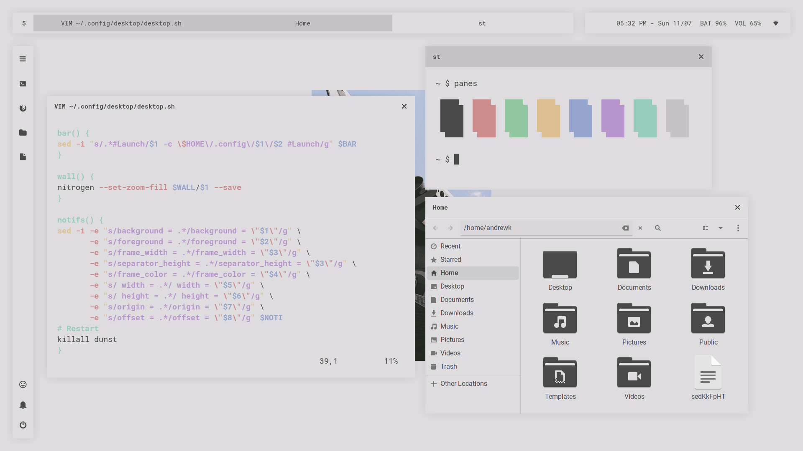
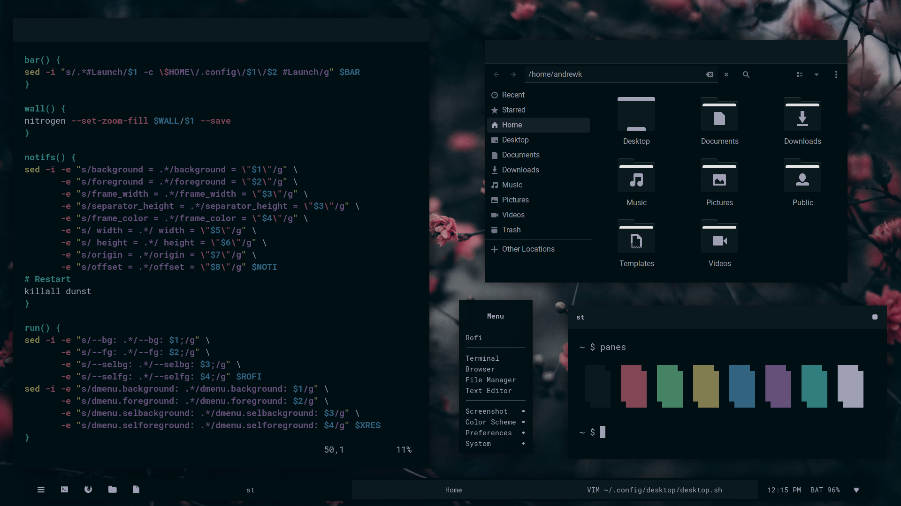
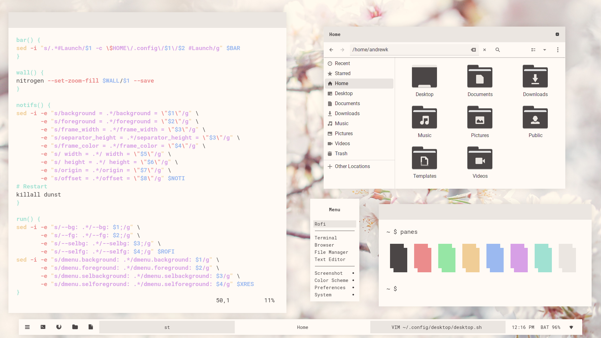
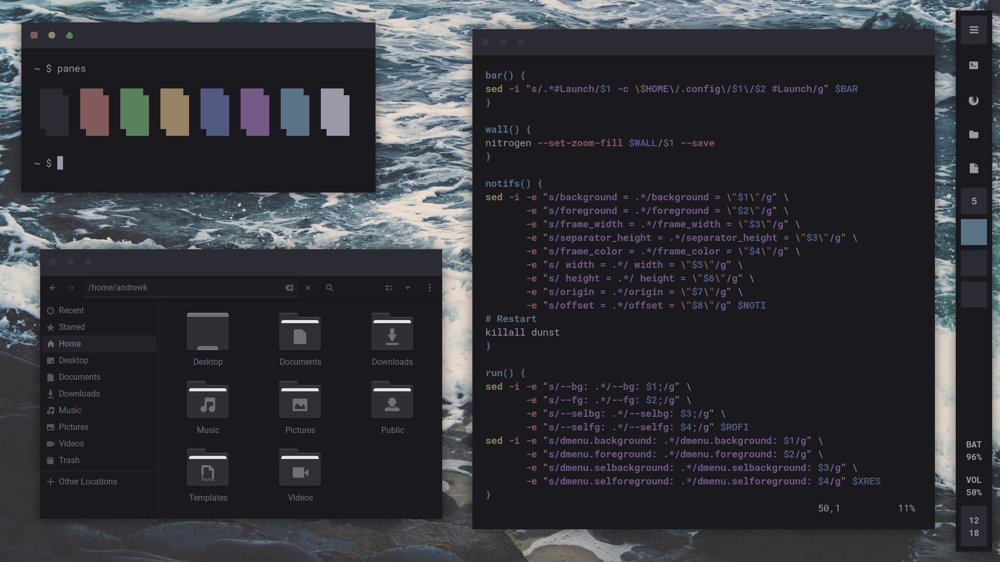
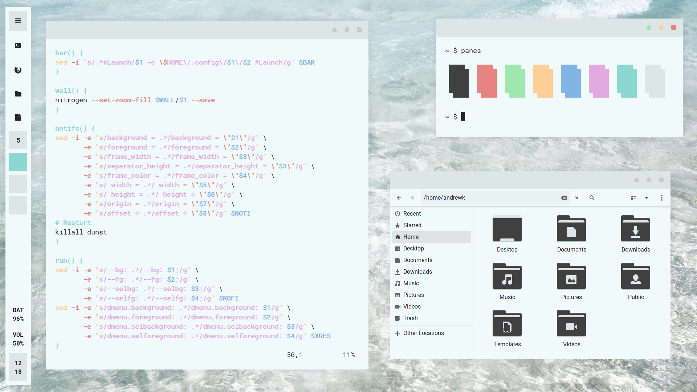
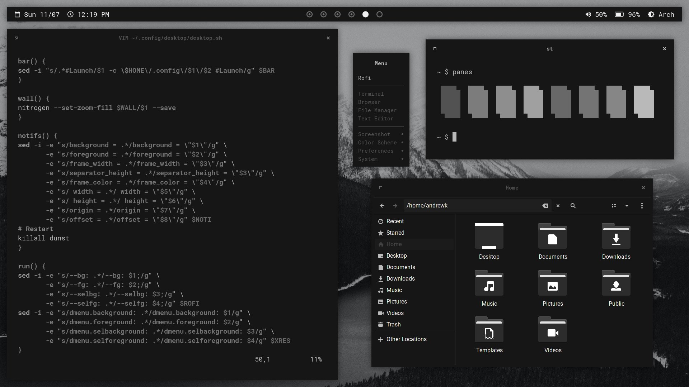
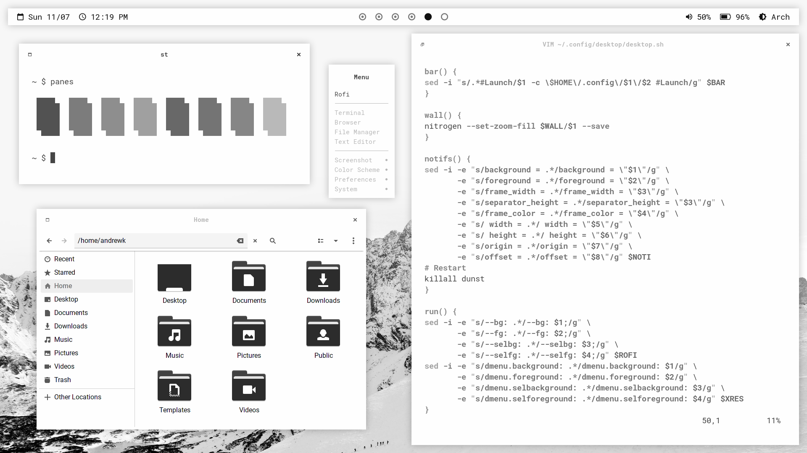
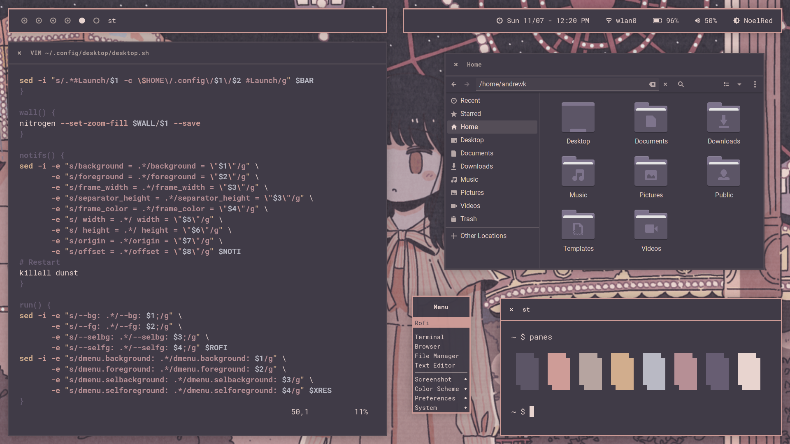
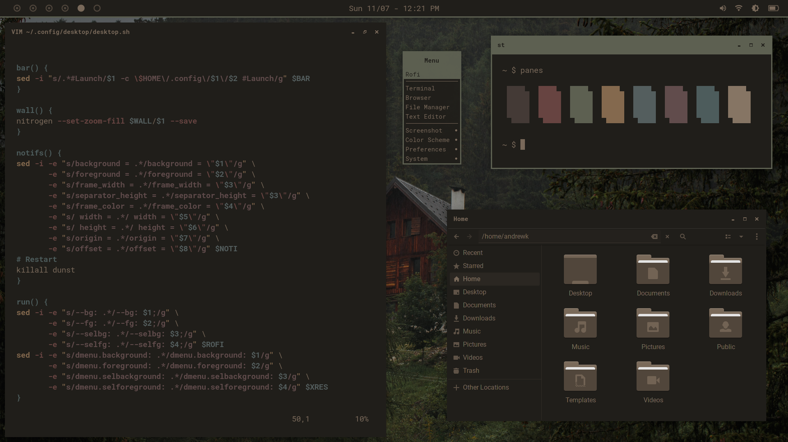

<h1 align=center>🌸 Sakura Dotfiles 🌸</h1>



## Overview

These files work together to achieve a unified desktop that can be changed on the fly. **Changing and/or removing these files may break it. Make sure you know what you're doing before messing with them.**

This project aims to provide several cohesive desktops that can be changed on the fly. It also aims to be easy to create new desktops through configuration files. It is not meant to be an easy way to change your desktop's color scheme quickly; you will need to create a file for a new desktop and specify what you want it to change.

## Pictures

|        |        |
| ------------------------------------------------------ | --------------------------------------------------------- |
|           |           |
|  |  |
|                            |                               |
|                         |                      |


## FAQ

> Is this made for beginners?

No. These are my personal desktops and configurations, and may not be suitable for other people. I would recommend at least an understanding of how window managers work, experience with using them, and a willingness to learn. 

> Isn't this like [Archcraft](https://archcraft.io/)?

Yes! I started this project in December of 2020, but didn't know about Archcraft until about I was about half a year in. As this project has evolved, it has become closer and closer to how Archcraft looks and feels. I intend to add more features to differentiate it from Archcraft, and don't believe this is just an Archcraft "clone." That being said, I recommend Archcraft to anyone looking for a more polished experience than what this project currently provides.

> Isn't this like [Flavours](https://github.com/Misterio77/flavours)?

No. The purpose of Flavours is to quickly and easily change your *existing desktop's* color scheme. The purpose of this project is to change your *desktop* with existing configurations- that means changing your bar, gtk theme, window decorations, and more to something preset.

> I have suggestions, ideas, or something to contribute. What should I do?

You can file an issue, submit a pull request, or contact me directly. All of these are welcome, and I'd be happy to get feedback on this project. You can contact me on discord @Stardust-kyun#5994.

> What are your plans for this?

Since the last update, I've added a lot of new things. There are *6* new desktops, easy to use configuration files for editing existing desktops and creating new ones, and much more. Since this is such a big update, there likely won't be an installation script for a while. The end goal is to turn this into its own distribution, but that is far into the future.

## Installation

I have found my dotfiles to work out of the box on EndeavourOS. If you're using EndeavourOS, you will need to install **only** `base-devel and common packages` as well as the following packages. It is very likely that there are some missing packages.

From official repos:
```
sudo pacman -S obconf dunst picom xsettingsd sddm qt5 qt5-quickcontrols2 qt5-svg firefox librewolf nitrogen nautilus mousepad vim maim polkit-gnome network-manager-applet blueberry lxappearance xorg light pulseaudio pulseaudio-alsa pulseaudio-bluetooth alsa-utils alsa-plugins alsa-firmware ttf-roboto-mono ttf-roboto ttf-iosevka noto-fonts noto-fonts-cjk noto-fonts-emoji xdg-user-dirs tint2 rofi i3lock-color zathura alacritty urxvt kitty
```


If you don't already have it installed, I suggest using [yay](https://aur.archlinux.org/packages/yay/) as your AUR helper.

From the AUR:
```
yay -S polybar gtk3-nocsd-git skippy-xd-git
```

From source:

- My patched build of [openbox](https://github.com/Stardust-kyun/openbox) with fixed window decorations for maximized windows.
- Siduck's patched build of [st](https://github.com/siduck/st) with a multitude of features.

There currently isn't an installation script for my dotfiles, so follow this:

- Files in the `home` directory should go in your user's home directory.

- Files in the `bin` directory should go in either `/bin` or `/usr/bin`.

- Files in the `usr/share` directory should go in `/usr/share`.

- After copying `usr/share/icons`, run `tar -xzvf filename.tar.gz` to extract.

- After installing `sddm`, you will need to enable it with `sudo systemctl enable sddm`.

- After cloning the repo for openbox, cd into the repo and run `./bootstrap`, `./configure --prefix=/usr --sysconfdir=/etc`, `make`, then `sudo make install` **in that order**.

- You will need to substitute `home/.mozilla/firefox/default-release` or `home/.librewolf/default-release`  with your default release directory. These are usually follow `xxxxxxxx.default-release` as their naming scheme. You will need to go to `about:config` and enable `toolkit.legacyUserProfileCustomizations.stylesheets`.

You may also need to install `rsync` to merge the dotfiles with your existing directories. Here's an example:

```
git clone https://github.com/Stardust-kyun/dotfiles
rsync -a dotfiles/home/ ~/
```

This will clone my dotfiles and merge the `home` directory of the dotfiles with the user's home directory.

## Quick Start

If this is your first time using my dotfiles, I would recommend starting by using `Alt+k` to bring up the keybindings menu. This will display most if not all of the keybindings used. You can also use the right click menu to launch some applications instead of using rofi.