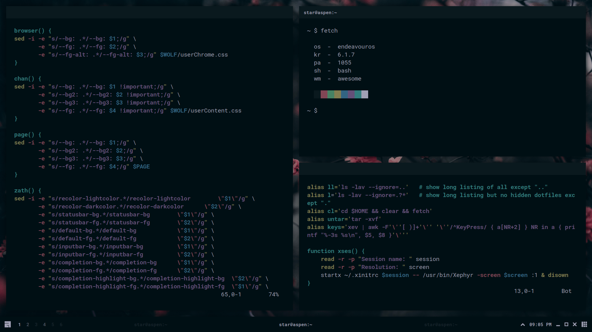
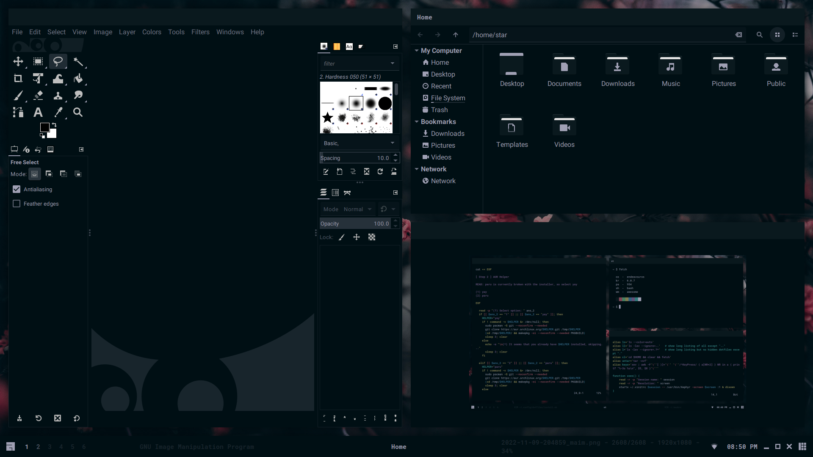
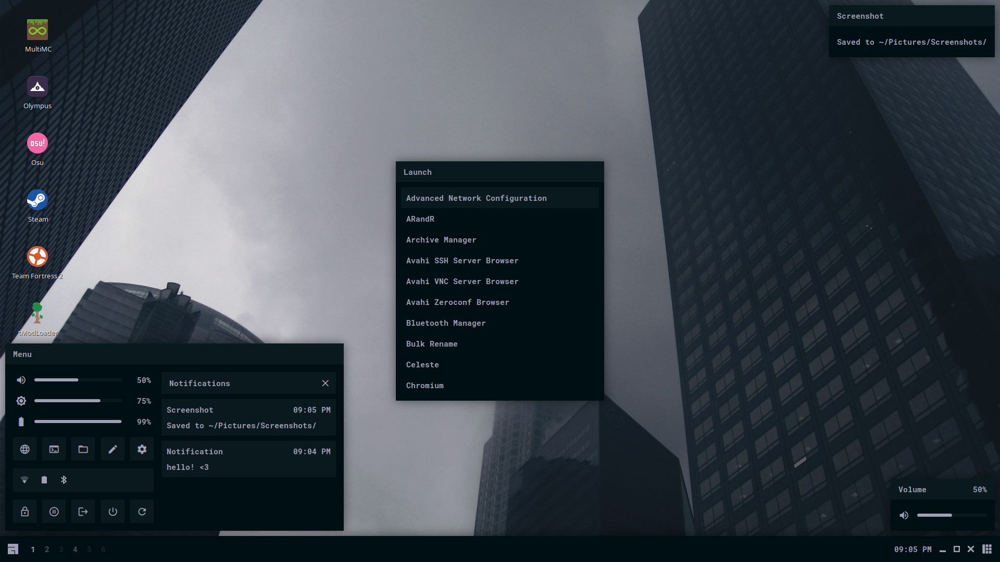
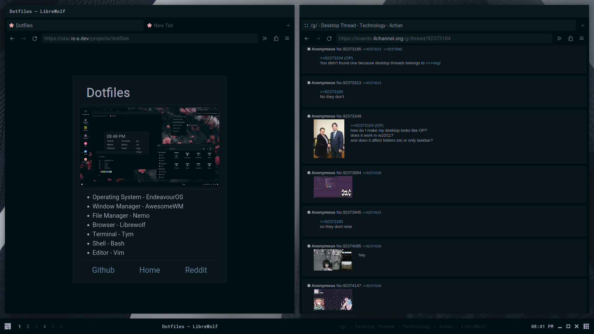
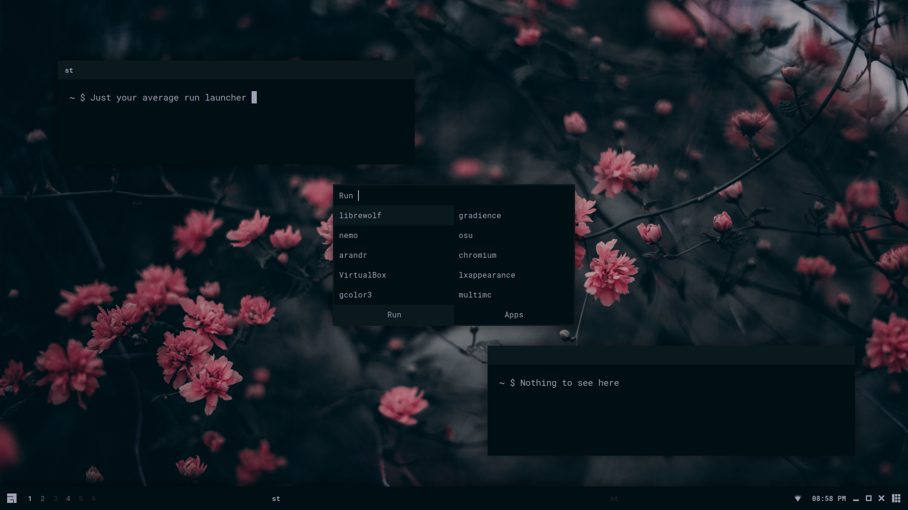
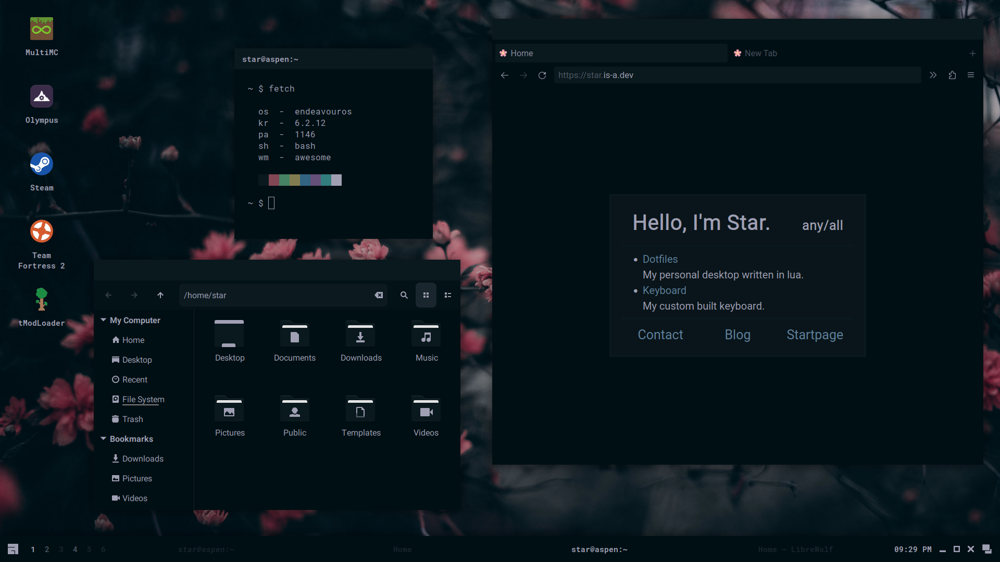
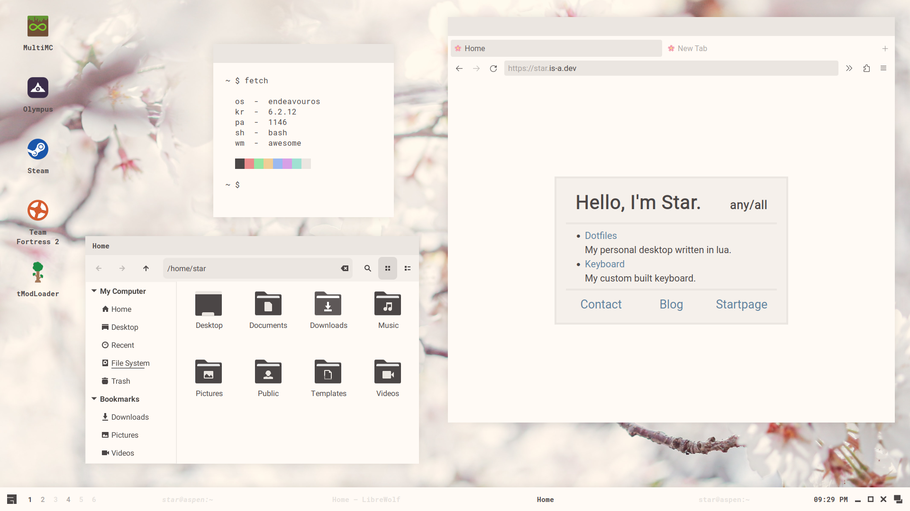
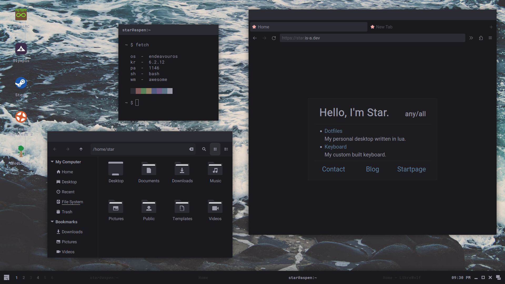
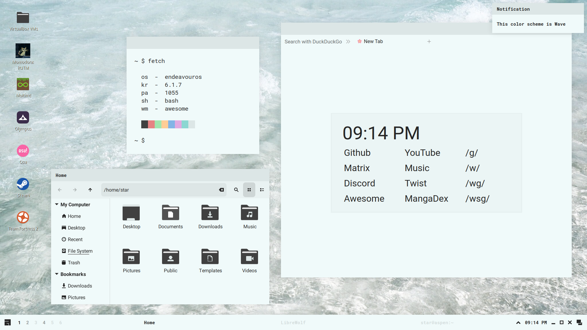
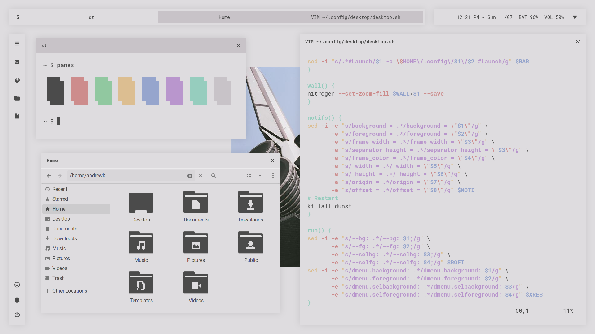

<h1 align=center>Sakura Dotfiles</h1>

<div align="center">
<a href="#install">Install</a> - <a href="#usage">Usage</a> - <a href="#gallery">Gallery</a> - <a href="#credit">Credit</a> - <a href="#contact">Contact</a>
</div>

<h1></h1>


This is my desktop made with awesomewm! Here's some details:

- **Operating System** - endeavouros
- **Window Manager** - awesomewm
- **File Manager** - nemo
- **Browser** - librewolf
- **Terminal** - tym
- **Shell** - bash
- **Editor** - vim

## Install

### Read Before Installing

This installation script is built to hopefully make the installation process easier for you. I cannot guarantee that it will work; there may be missing packages and you may run into issues. If something is missing and/or doesn't work, I would recommend reading over the manual install instructions to find missing packages or steps. If that doesn't work, see <a href="#contact">contact</a>.

<details>
<summary><b>Manual Installation</b></summary>

---

### Minimal Installation Packages

These packages use their names from the Arch repos and AUR. If you can't find them for your distribution, try using the source url from Arch repos.

- base-devel - utilities
- xorg - display server
    + xclip - clipboard
    + xorg-xprop - fetch dep
    + xsettingsd - reload gtk/icons
- pipewire - audio
- light - brightness
    + inotify-tools - brightness widget dep
- lightdm - display manager
    + lightdm-webkit2-greeter - greeter
    + light-locker - lock screen
- awesome-git - window manager
- rofi - run launcher
- picom - compositor
- polkit-gnome - polkit
- xdg-user-dirs - generate home dirs
- maim - screenshot
- ttf-roboto - gtk font
- ttf-roboto-mono - mono font
- noto-fonts - font support
- noto-fonts-cjk - cjk font support
- noto-fonts-emoji - emoji font support
- noto-fonts-extra - extra font support
- papirus-icon-theme - icon theme
- xcursor-breeze - cursor theme

### Utilities

- gvim - vim with clipboard
- librewolf - browser
- nemo - file manager
- viewnior - image viewer
- zathura - pdf viewer
- network-manager-applet - network applet
- cbatticon - battery applet
- volumeicon - volume applet

### Setup

- copy contents of `home` to `~/`
- copy contents of `usr/share` to `/usr/share`
- copy contents of `usr/bin` to `/usr/bin`
- copy contents of `lib/librewolf` to `/lib/librewolf` (if librewolf installed)
    + edit mozilla.cfg and replace `USER` with your user's name
- uncomment `#greeter-session=` and set it to `lightdm-webkit2-greeter` in `/etc/lightdm/lightdm.conf`
- set `webkit_theme` to `minimal` in `/etc/lightdm/lightdm-webkit2-greeter.conf`
- enable lightdm service
- enable NetworkManager service (if network-manager-applet installed)
- make contents of `~/.config/awesome/bin` executable
- update font cache `fc-cache -fv`
- update xrdb `xrdb ~/.Xresources`
- generate home dirs `xdg-user-dirs-update`
- make screenshots dir in `~/Pictures/Screenshots`

---

</details>

<details>
<summary><b>Installation Script</b></summary>

---

### Distro Installation

First, you'll need to install the distribution of your choice. Currently supported distros are Arch-based, Debian-based, Fedora-based, Gentoo-based, Void, OpenSUSE, and Alpine. It's recommended to install `xorg` and `pipewire` manually prior to running the script. You will need to install `git` to clone the repository.

Other distributions are not officially supported and may be added in the future.

### After System Installation

```
git clone https://github.com/stardust-kyun/dotfiles ~/dotfiles
cd ~/dotfiles
./install.sh

# Install with log
script -c ./install.sh ~/dotfiles-log.txt 
```

---

</details>

## Usage

<details>
<summary><b>Post-Install Setup</b></summary>

---

### Minimal Install Setup

Since the minimal install doesn't include many programs/utilities, you'll need to install some before rebooting. I recommend installing a terminal, browser, file manager, and text editor. 

### Configuration

The file `~/.config/awesome/rc.lua` contains configuration options for awesome's default commands:

| Configuration  | Description              | Default                            |
| -------------- | ------------------------ | ---------------------------------- |
| `c.terminal`   | Default Terminal         | `"tym"`                             |
| `c.browser`    | Default Web Browser      | `"librewolf"`                      |
| `c.files`      | Default File Manager     | `"nemo"`                           |
| `c.editor`     | Default Text Editor      | `"vim"`                            |
| `c.editor_cmd` | Default Editor Command   | `c.terminal .. " -e " .. c.editor` |
| `c.modkey`     | Default Modkey           | `"Mod4"`                           |
| `c.shutdown`   | Default Shutdown Command | `"systemctl poweroff"`                   |
| `c.reboot`     | Default Reboot Command   | `"systemctl reboot"`                         |

If your distribution uses `runit` instead of `systemd` you will need to set `c.shutdown` and `c.reboot` to `loginctl poweroff` and `loginctl reboot`, respectively. You must have `elogind` installed and enabled for this to work.

---

</details>

<details>
<summary><b>Keybindings</b></summary>

---

### Configuration

The file `~/.config/awesome/config/bind.lua` contains awesome's keybindings:

| Keybinding         | Description           |
| ------------------ | --------------------- |
| `Mod+Enter`        | Open a Terminal       |
| `Mod+k`            | Show Keybindings      |
| `Mod+0`            | Show Power Menu       |
| `Mod+d`            | Show Run Launcher     |
| `Mod+e`            | Show Kaomoji Menu     |
| `Mod+Shift+d`      | Show Desktop Menu     |
| `Mod+Delete`       | Full Screenshot       |
| `Mod+Shift+Delete` | Partial Screenshot    |
| `Mod+Tab`          | Focus Next Window     |
| `Mod+Shift+Tab`    | Focus Previous Window |
| `Mod+1-6`          | Change Tag            |
| `Mod+Shift+1-6`    | Move Client to Tag    |
| `Mod+f`            | Toggle Fullscreen     |
| `Mod+s`            | Toggle Floating       |
| `Mod+m`            | Toggle Maximize       |
| `Mod+Shift+q`      | Close Window          |

---

</details>

## Gallery

<details>
<summary><b>Programs/Widgets</b></summary>

### Terminal


### Graphical


### Widget


### Browser


### Launcher


</details>

<details>
<summary><b>Color Schemes</b></summary>

### Sakura


### Bloom


### Shore


### Wave


### Shuttle


</details>

## Credit

### Contributions

- [AloneERO](https://gitlab.com/AloneER0) for help adding support for Void, Fedora, OpenSUSE, and Alpine!
- [Frankfut](https://github.com/frankfutlg) for help adding support for Void.
- [Qwickdom](https://github.com/Qwickdom) for help adding support for Arch.
- [Reverse](https://github.com/Reversedc) for help adding support for Debian.
- [Alyssa](https://github.com/alyssa-sudo) for help adding support for Gentoo.
- [Crylia](https://github.com/Crylia) and [Sammy](https://github.com/TorchedSammy) for massive amounts of help learning awesomewm.
- [Jimmy](https://github.com/Jimmysit0) and [Petrolblue](https://github.com/petrolblue) for help with color schemes and lots of support.

### Projects

- [DmgBlue](https://github.com/davidmogar/lightdm-webkit2-dmg_blue), which I based my greeter on.
- [Materia](https://github.com/nana-4/materia-theme), which I based my gtk themes on.
- [Papirus](https://github.com/PapirusDevelopmentTeam/papirus-icon-theme), which I based my icon themes on.

## Contact

You can find me on discord at [Stardust-kyun#5994](https://discord.com/users/417133059654156299) and matrix at `stardust-kyun:matrix.org`. I also have a [discord server](https://discord.gg/38hQb6V8AW) with help available and updates for when new features are added.
