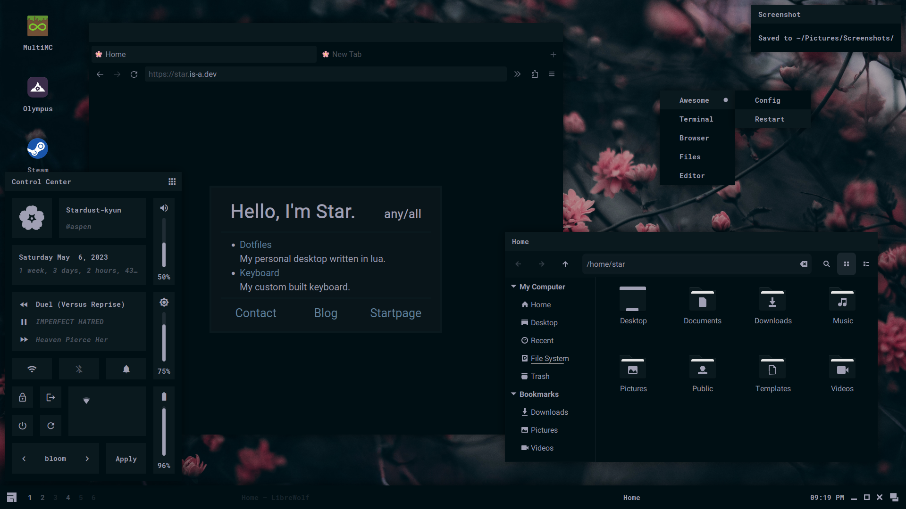
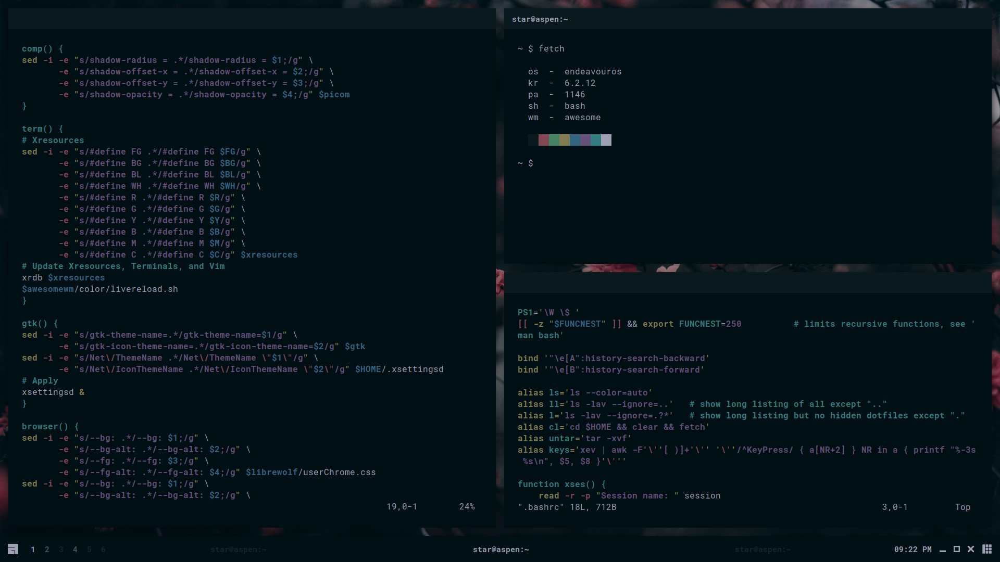
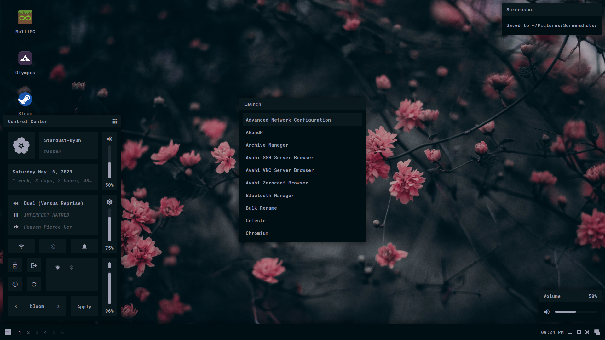

<h1 align=center>Sakura Dotfiles</h1>

<div align="center">
<a href="#install">Install</a> - <a href="#usage">Usage</a> - <a href="#gallery">Gallery</a> - <a href="#credit">Credit</a> - <a href="#contact">Contact</a>
</div>

<h1></h1>



This is my desktop made with awesomewm! Here's some details:

- **Operating System** - endeavouros
- **Window Manager** - awesomewm
- **File Manager** - nemo
- **Browser** - librewolf
- **Terminal** - tym
- **Shell** - bash
- **Editor** - vim

## Install

### Read Before Installing

This installation script is built to hopefully make the installation process easier for you. I cannot guarantee that it will work; there may be missing packages and you may run into issues. If something is missing and/or doesn't work, I would recommend reading over the manual install instructions to find missing packages or steps. If that doesn't work, see <a href="#contact">contact</a>.

<details>
<summary><b>Manual Installation</b></summary>

---

### Minimal Installation Packages

These packages use their names from the Arch repos and AUR. If you can't find them for your distribution, try using the source url from Arch repos.

- base-devel - utilities
- xorg - display server
    + xclip - clipboard
    + xorg-xprop - fetch dep
    + xsettingsd - reload gtk/icons
- pipewire - audio
- brightnessctl - brightness
    + inotify-tools - brightness widget dep
- awesome-git - window manager
- rofi - run launcher
- picom - compositor
- polkit-gnome - polkit
- xdg-user-dirs - generate home dirs
- maim - screenshot
- ttf-roboto - gtk font
- ttf-roboto-mono - mono font
- noto-fonts - general font support
- noto-fonts-cjk - cjk font support
- noto-fonts-emoji - emoji font support
- noto-fonts-extra - extra font support
- papirus-icon-theme - icon theme

### Utilities

- gvim - vim with clipboard
- librewolf - browser
- nemo - file manager
- gpicview - image viewer
- zathura - pdf viewer
- network-manager-applet - network applet
- cbatticon - battery applet
- blueman - bluetooth applet

### Setup

- copy contents of `home` to `~/`
- copy contents of `usr/share` to `/usr/share`
- copy contents of `usr/bin` to `/usr/bin`
- enable NetworkManager service (if network-manager-applet installed)
- update font cache `fc-cache -fv`
- update xrdb `xrdb ~/.Xresources`
- generate home dirs `xdg-user-dirs-update`
- make screenshots dir in `~/Pictures/Screenshots`

---

</details>

<details>
<summary><b>Installation Script</b></summary>

---

### Distro Installation

First, you'll need to install the distribution of your choice. Currently supported distros are Arch-based, Debian-based, Fedora-based, Gentoo-based, Void, OpenSUSE, and Alpine. It's recommended to install `xorg` and `pipewire` manually prior to running the script. You will need to install `git` to clone the repository.

Other distributions are not officially supported and may be added in the future.

### After System Installation

```
git clone https://github.com/stardust-kyun/dotfiles ~/dotfiles
cd ~/dotfiles
./install.sh

# Install with log
script -c ./install.sh ~/dotfiles-log.txt 
```

---

</details>

## Usage

<details>
<summary><b>Post-Install Setup</b></summary>

---

### Minimal Install Setup

Since the minimal install doesn't include many programs/utilities, you'll need to install some before rebooting. I recommend installing a terminal, browser, file manager, and text editor. 

### Configuration

The file `~/.config/awesome/rc.lua` contains configuration options for awesome's default commands:

| Configuration | Description            | Default                                                                                                |
| ------------- | ---------------------- | ------------------------------------------------------------------------------------------------------ |
| `modkey`      | Modkey                 | `"Mod4"`                                                                                               |
| `batt`        | Battery Name           | `"BAT0"`                                                                                               |
| `passwd`      | Lockscreen Password    | `"awesomewm"`                                                                                          |
| `sessionlock` | Lock on Session Start  | `true` (commented)                                                                                     |
| `terminal`    | Terminal               | `"tym"`                                                                                                |
| `browser`     | Web Browser            | `"librewolf"`                                                                                          |
| `files`       | File Manager           | `"nemo"`                                                                                               |
| `editor`      | Text Editor            | `"vim"`                                                                                                |
| `editorcmd`   | Editor Command         | `terminal .. " -e  \"" .. editor .. "\""`                                                              |
| `config`      | Config Editing Command | `terminal .. " -e \"" .. editor .. " " .. require("gears").filesystem.get_configuration_dir() .. "\""` |
| `lock`        | Lock Command           | `"awesome-client command 'lock()'"`                                                                    |
| `suspend`     | Suspend Command        | `"awesome-client command 'lock()' && systemctl suspend"`                                               |
| `exit`        | Exit Command           | `"awesome-client command 'awesome.quit()'"`                                                            |
| `shutdown`    | Shutdown Command       | `"systemctl poweroff"`                                                                                 |
| `reboot`      | Reboot Command         | `"systemctl reboot"`                                                                                   |
| `font`        | Font                   | `"RobotoMono Bold 11"`                                                                                 |
| `fontalt`     | Alt Font               | `"RobotoMono Italic Bold 11"`                                                                          |
| `fonticon`    | Icon Font              | `"Material Icons 16"`                                                                                  |
| `color`       | Color Scheme           | `require("color.sakura")`                                                                              |
| `wallpaper`   | Wallpaper              | `os.getenv("HOME") .. "/Pictures/Wallpaper/Fog.png"` (commented)                                       |
| `shotdir`     | Reboot Command         | `"~/Pictures/Screenshots/"`                                                                            |

If your distribution uses `runit` instead of `systemd` you will need to set `shutdown` and `reboot` to `loginctl poweroff` and `loginctl reboot`, respectively. You must have `elogind` installed and enabled for this to work.

---

</details>

<details>
<summary><b>Keybindings</b></summary>

---

### Configuration

The file `~/.config/awesome/config/bind.lua` contains awesome's keybindings:

| Keybinding         | Description                   |
| ------------------ | ----------------------------- |
| `Mod+Shift+r`      | Restart Awesome               |
| `Mod+z`            | Next Layout                   |
| `Mod+Enter`        | Open a Terminal               |
| `Mod+p`            | Kill Picom                    |
| `Mod+Shift+p`      | Start Picom                   |
| `Mod+d`            | Show Run Launcher             |
| `Mod+Shift+d`      | Show Color Menu               |
| `Mod+Delete`       | Full Screenshot               |
| `Mod+Ctrl+Delete`  | Delayed Screenshot            |
| `Mod+Shift+Delete` | Partial Screenshot            |
| `Mod+Space`        | Show Launcher                 |
| `Mod+c`            | Center Window                 |
| `Mod+Tab`          | Focus Next Window             |
| `Mod+Shift+Tab`    | Focus Previous Window         |
| `Mod+1-6`          | Change Tag                    |
| `Mod+Ctrl+1-6`     | Move Client to Tag            |
| `Mod+Shift+1-6`    | Move Client to Tag and Follow |
| `Mod+f`            | Toggle Fullscreen             |
| `Mod+s`            | Toggle Floating               |
| `Mod+m`            | Toggle Maximize               |
| `Mod+Shift+q`      | Close Window                  |

---

</details>

## Gallery

<details>
<summary><b>Programs/Widgets</b></summary>

### Terminal


### Graphical


### Widget


### Browser


### Lock Screen


</details>

<details>
<summary><b>Color Schemes</b></summary>

### Sakura


| Color      | Hexcode |
| ---------- | ------- |
| Background | #000f14 |
| Foreground | #a0a0b4 |
| Black      | #0a191e |
| White      | #a0a0b4 |
| Red        | #824655 |
| Green      | #468264 |
| Yellow     | #827d50 |
| Blue       | #326482 |
| Magenta    | #645078 |
| Cyan       | #327d7d |

### Bloom


| Color      | Hexcode |
| ---------- | ------- |
| Background | #fffaf5 |
| Foreground | #4b4646 |
| Black      | #4b4646 |
| White      | #ebe6e1 |
| Red        | #eb8c8c |
| Green      | #96e6a5 |
| Yellow     | #f0cd96 |
| Blue       | #9bb9f0 |
| Magenta    | #d7a0e6 |
| Cyan       | #a0e1d2 |

### Shore


| Color      | Hexcode |
| ---------- | ------- |
| Background | #19191e |
| Foreground | #9999a8 |
| Black      | #2b2b33 |
| White      | #9999a8 |
| Red        | #825a5a |
| Green      | #5a825a |
| Yellow     | #968264 |
| Blue       | #505a82 |
| Magenta    | #735a87 |
| Cyan       | #5a7387 |

### Wave


| Color      | Hexcode |
| ---------- | ------- |
| Background | #f0fafa |
| Foreground | #262626 |
| Black      | #404040 |
| White      | #dce6e6 |
| Red        | #e68383 |
| Green      | #a0e6af |
| Yellow     | #ffcd96 |
| Blue       | #83b4e6 |
| Magenta    | #e1aae1 |
| Cyan       | #8cd7d2 |

</details>

## Credit

### Contributions

- [AloneERO](https://gitlab.com/AloneER0) for help adding support for Void, Fedora, OpenSUSE, and Alpine!
- [Frankfut](https://github.com/frankfutlg) for help adding support for Void.
- [Qwickdom](https://github.com/Qwickdom) for help adding support for Arch.
- [Reverse](https://github.com/Reversedc) for help adding support for Debian.
- [Alyssa](https://github.com/alyssa-sudo) for help adding support for Gentoo.
- [Crylia](https://github.com/Crylia) and [Sammy](https://github.com/TorchedSammy) for massive amounts of help learning awesomewm.
- [Jimmy](https://github.com/Jimmysit0) and [Petrolblue](https://github.com/petrolblue) for help with color schemes and lots of support.

### References

- [Sammy's Dotfiles](https://github.com/TorchedSammy/dotfiles)
- [Saimoom's Dotfiles](https://github.com/saimoomedits/dotfiles)
- [Nuxsh's Dotfiles](https://github.com/nuxshed/dotfiles)
- [Elena's Dotfiles](https://github.com/elenapan/dotfiles)

### Projects

- [Papirus](https://github.com/PapirusDevelopmentTeam/papirus-icon-theme)
- [Phocus](https://github.com/phocus/gtk)

## Contact

You can find me on discord at [Stardust-kyun#5994](https://discord.com/users/417133059654156299), matrix at [stardust-kyun:matrix.org](https://matrix.to/#/@stardust-kyun:matrix.org), and email at [stardust-kyun@proton.me](mailto:stardust-kyun@proton.me). I also have a [discord server](https://discord.gg/38hQb6V8AW) with help available and updates for when new features are added.
