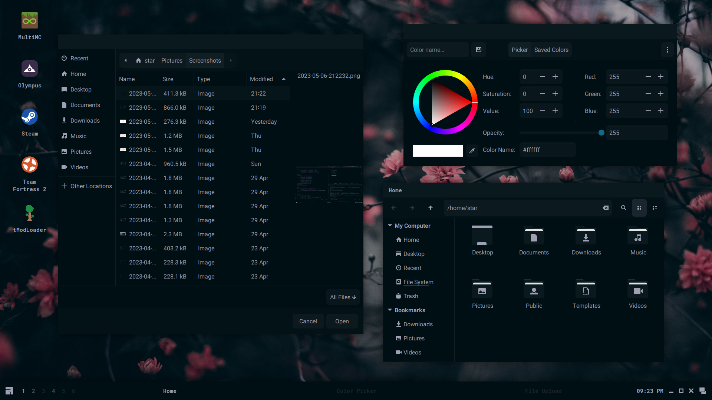
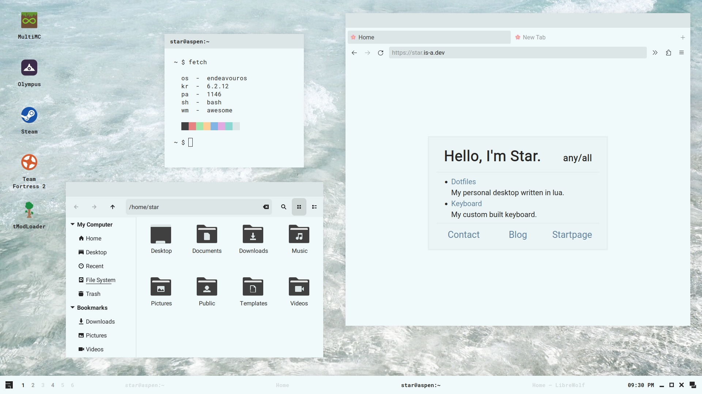

<h1 align=center>Sakura Dotfiles</h1>

<div align="center">
<h6 href="#install">Install</h6> - <h6 href="#usage">Usage</h6> - <h6 href="#gallery">Gallery</h6> - <h6 href="#credit">Credit</h6> - <h6 href="#contact">Contact</h6>
</div>


This is my desktop made with awesomewm! Here's some details:

- **Operating System** - endeavouros
- **Window Manager** - awesomewm
- **File Manager** - nautilus
- **Browser** - librewolf
- **Terminal** - st
- **Shell** - bash
- **Editor** - vim

## Install

### Read Before Installing:

These installation scripts are built to hopefully make the installation process easier for you. I cannot guarantee that they will work, there may be missing packages, and you may run into issues. If something is missing and/or doesn't work, I would recommend reading over the Arch script to find missing packages or steps. If that doesn't work, see <a href="#contact">contact</a>.

<details>
<summary><b>Arch-based</b></summary>

### Arch

Using archinstall (relevant options):

- User account - Create a user with sudo access
- Profile - `xorg`
- Audio - `pipewire`
- Additional packages - `git`

### EndeavourOS

Install a minimal system without a desktop environment.

### After System Installation

```
$ git clone https://github.com/stardust-kyun/dotfiles ~/dotfiles
$ cd ~/dotfiles
$ ./install-arch.sh

# Install with log
$ script -c ./install-arch.sh ~/dotfiles-log.txt 
```

</details>

<details>
<summary><b>Fedora-based</b></summary>

# Read:

This script is still in development and may have a lot of issues. Some things may not work, use with caution.

### Fedora

Install Fedora Workstation.

### After System Installation

```
$ git clone https://github.com/stardust-kyun/dotfiles ~/dotfiles
$ cd ~/dotfiles
$ ./install-fedora.sh

# Install with log
$ script -c ./install-fedora.sh ~/dotfiles-log.txt 
```

</details>

Other distributions are not yet supported and may be added in the future.

## Usage

<details>
<summary><b>Post-Install Setup</b></summary>

### Minimal Install Setup

Since the minimal install doesn't include many programs/utilities, you'll need to install some before rebooting. I recommend installing a terminal, browser, file manager, and text editor. 

### Configuration

The file `~/.config/awesome/rc.lua` contains configuration options for awesome's default commands:

| Configuration  | Description            | Default                            |
| -------------- | ---------------------- | ---------------------------------- |
| `c.terminal`   | Default Terminal       | `"st"`                             |
| `c.browser`    | Default Web Browser    | `"librewolf"`                      |
| `c.files`      | Default File Manager   | `"nemo"`                           |
| `c.editor`     | Default Text Editor    | `"vim"`                            |
| `c.editor_cmd` | Default Editor Command | `c.terminal .. " -e " .. c.editor` |
| `c.modkey`     | Default Modkey         | `"Mod4"`                           |

</details>

<details>
<summary><b>Keybindings</b></summary>

### Configuration

The file `~/.config/awesome/config/bind.lua` contains awesome's keybindings:

| Keybinding         | Description           |
| ------------------ | --------------------- |
| `Mod+Enter`        | Open a Terminal       |
| `Mod+k`            | Show Keybindings      |
| `Mod+0`            | Show Power Menu       |
| `Mod+d`            | Show Run Launcher     |
| `Mod+e`            | Show Kaomoji Menu     |
| `Mod+Shift+d`      | Show Desktop Menu     |
| `Mod+Delete`       | Full Screenshot       |
| `Mod+Shift+Delete` | Partial Screenshot    |
| `Mod+Tab`          | Focus Next Window     |
| `Mod+Shift+Tab`    | Focus Previous Window |
| `Mod+1-6`          | Change Tag            |
| `Mod+Shift+1-6`    | Move Client to Tag    |
| `Mod+f`            | Toggle Fullscreen     |
| `Mod+s`            | Toggle Floating       |
| `Mod+m`            | Toggle Maximize       |
| `Mod+Shift+q`      | Close Window          |

</details>

## Gallery

<details>
<summary><b>Programs/Widgets</b></summary>

### Terminal


### Graphical


### Widget


### Browser


### Launcher


</details>

<details>
<summary><b>Color Schemes</b></summary>

### Sakura


### Bloom


### Shore


### Wave


### Shuttle


</details>

## Credit

### Contributions

- [Qwickdom](https://github.com/Qwickdom) for help adding brightness support and an installation script.
- [Crylia](https://github.com/Crylia) for massive amounts of help learning awesomewm.
- [Sammy](https://github.com/TorchedSammy) for helping me learn awesomewm's widget system.
- [Jimmy](https://github.com/Jimmysit0) and [Petrolblue](https://github.com/petrolblue) for help with color schemes and lots of support.

### Projects

- [Siduck's st](https://github.com/siduck76/st) for my personal choice of terminal.
- [DmgBlue](https://github.com/davidmogar/lightdm-webkit2-dmg_blue), which I based my greeter on.
- [Materia](https://github.com/nana-4/materia-theme), which I based my gtk themes on.
- [Papirus](https://github.com/PapirusDevelopmentTeam/papirus-icon-theme), which I based my icon themes on.

## Contact

You can find me on discord at `Stardust-kyun#5994` and matrix at `stardust-kyun:matrix.org`. I also have a [discord server](https://discord.gg/38hQb6V8AW) with help available and updates for when new features are added.
